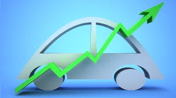
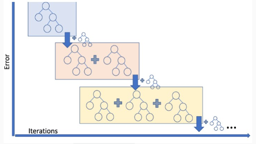
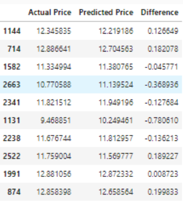

# AutoValuate-Advanced-ML-Model-for-Precise-Used-Vehicle-Pricing

    

This repository contains the machine learning model developed during a 36-hour hackathon held on 2023-11-21, where our team was awarded the first prize. The model estimates the price of used vehicles before an expert appraisal, utilizing several advanced machine learning techniques to ensure high accuracy and reliability.

## Project Overview

Our project aimed to design and implement a machine learning model capable of predicting used vehicle prices with high precision. The model's performance was measured using various evaluation metrics such as R2 score, mean absolute error (MAE), median absolute error, and mean squared error (MSE). Additionally, we conducted an in-depth analysis of prediction deviations to further refine our approach.

## Data Exploration and Preprocessing

The initial phase of our project involved a thorough exploration and preprocessing of the data:

- **Categorical Variable Analysis**: We analyzed various categorical data points to understand their impact on vehicle pricing.
- **Data Summary and Visualizations**: Histograms and other visual tools were used to understand the distribution and behavior of data.
- **Correlation Matrix**: A detailed correlation analysis was performed for numerical variables to identify relationships and dependencies.

### Preprocessing Steps:

- **Handling Null Values**: We removed entries with missing data to maintain the quality of our dataset.
- **Outlier Removal**: Outliers were identified and removed to prevent skewed results.
- **Feature Engineering**: New variables were introduced, such as the vehicle's age extracted from its year of manufacture, to enhance model accuracy.
- **Linearity Check and Transformation**: A scatter plot was used to check linearity. Non-linear variables like 'Price' were logarithmically transformed to improve model performance.
- **Normalization**: Data normalization was performed to standardize the range of independent variables.

## Model Selection

We benchmarked 10 different machine learning algorithms to select the best performer for our regression task. Gradient Boosting emerged as the most effective algorithm, demonstrating superior performance across all metrics.

### Comparison Table

A comprehensive comparison of all tested models is provided in the included table, illustrating their performance in terms of various statistical metrics.

    

## Results and Presentation

Our model achieved excellent results, as detailed in the evaluation section of our presentation. The insights and methodologies are thoroughly documented and can be accessed via the link below:

[Presentation Link](https://example.com/presentation)

## Repository Contents

- **Source Code**: All the source code used in this project is available in this repository.
- **Data**: Datasets used for training and testing the model.
- **Documentation**: Detailed explanation of the methodology and model evaluations.

## The Team

This project was brought to life by a dedicated group of 2 individuals who combined their expertise in data science, machine learning. Our team's collaborative effort during the 36-hour hackathon led to a first-place finish, showcasing our innovative approach to tackling real-world problems. Here are the team members who made this possible:

- **Oumaima BADI** - Data Scientist
- **Boutaina ELYAZIJI** - Data Scientist

## Conclusion

Our approach to predicting used vehicle prices showcases the power of machine learning in automating and enhancing the accuracy of vehicle appraisals. We believe that this model can significantly aid businesses involved in the sale and purchase of used vehicles by providing a reliable pricing tool.

